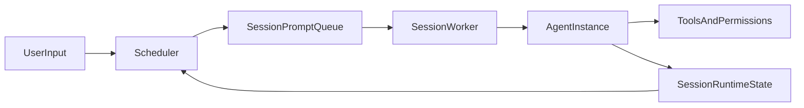

# Paragents

[中文文档](./README.zh-CN.md)

Paragents is a toy, easy-hack self-learning project for building a parallel-agent runtime in Python (`asyncio` + TUI). It is inspired by 4 other agent repos ([claude-code](https://github.com/anthropics/claude-code), [mercury-agent](https://github.com/cosmicstack-labs/mercury-agent), [hermes-agent](https://github.com/NousResearch/hermes-agent), [nanobot](https://github.com/HKUDS/nanobot)), and borrows ideas (and in some places implementation patterns) for learning and experimentation.  
It is intentionally optimized for readability and experimentation, not production hardening.

## Project Positioning

- This repo is an **experimental playground**, not a production framework.
- APIs and internal contracts may change quickly.
- The core value is to make agent runtime ideas easy to read, test, and iterate.

## Why Parallel-Agent

The current design focuses on **multi-session parallelism** with per-session continuity:

- Session-based scheduler and worker model
- Single active agent instance per session (reused across turns)
- Session-level context + memory persistence
- Preflight conflict checks (especially output conflicts) and approval flow
- TUI-first operations for observing multiple sessions



Key implementation files:

- `main.py`
- `scheduler.py`
- `agent_instance.py`
- `session_runtime.py`
- `tui_app.py`

## Demo

```markdown

```

## Quick Start (TUI Only)

1. Install dependencies

```bash
uv sync
```

2. Start TUI

```bash
uv run python main.py
```

3. First run setup

- If `runtime_config.json` is missing, startup enters interactive setup.
- You can reconfigure in TUI with:
  - `/setup`
  - `/show-config`

4. Command reference

| Command | Purpose |
|---|---|
| `/new <text>` | Create a new foreground session with the initial prompt |
| `/prompt <text>` | Continue current foreground session with a new prompt |
| `/submit <text>` | Submit a new background session |
| `/list` | List current sessions and their status |
| `/switch <session_ref>` | Switch foreground focus to a target session |
| `/close <session_ref>` | Close a session and release its slot |
| `/approvals` | Show pending approval requests |
| `/approve <request_ref> [always]` | Approve a pending request (optional persistent allow) |
| `/deny <request_ref>` | Deny a pending request |
| `/pause <prompt_ref>` | Pause a running prompt |
| `/resume <session_ref>` | Resume paused prompt in target session |
| `/cancel <prompt_ref>` | Cancel target prompt |
| `/permissions` | Print current effective permission config |
| `/setup` | Re-run runtime/provider setup |
| `/show-config` | Show runtime config file path and provider info |
| `/quit` | Exit TUI |


## Cross-Repo Learning Notes (inlined)

Legend:

- **Code verified**: implementation or interface is directly confirmed in code.
- **Docs/changelog signal**: mainly inferred from README/changelog/config examples; full core implementation may not be fully open.

### 1) Permission and Capability Governance

| Dimension | Paragents | claude-code | mercury-agent | hermes-agent | nanobot |
|---|---|---|---|---|---|
| Capability switches | `PermissionsConfig.capabilities` (**Code verified**) | Tool-level permission governance in settings (**Docs/changelog signal**) | `permissions.yaml` + capability registry (**Code verified**) | Governance via toolset/gateway composition (**Code verified**) | `ToolsConfig` level toggles (**Code verified**) |
| ask/deny semantics | `needs_approval / blocked / auto_approved` (**Code verified**) | Explicit `ask/deny` (**Code verified**) | Command pattern-based approvals (**Code verified**) | Approval is more runtime-pipeline oriented (**Code verified**) | Primarily `enable/sandbox/restrict` style (**Code verified**) |
| File scope control | `fs_scopes` (**Code verified**) | Combined through tool permissions + policy layering (**Docs/changelog signal**) | File scopes (**Code verified**) | Mostly enforced in tool runtime (**Code verified**) | `restrict_to_workspace` (**Code verified**) |
| Sandbox/network policy | Relatively lightweight currently (**Code verified**) | `sandbox.network.*` (**Code verified**) | Basic shell constraints (e.g., cwd) (**Code verified**) | More gateway/runtime governance oriented (**Code verified**) | `exec.sandbox` + SSRF allowlist (**Code verified**) |

### 2) Context, Compaction, and Recovery

| Dimension | Paragents | claude-code | mercury-agent | hermes-agent | nanobot |
|---|---|---|---|---|---|
| Session continuity | Session worker + one reused agent per session (**Code verified**) | Strong `--resume/--continue` semantics (**Docs/changelog signal**) | conversationId-scoped short-term memory (**Code verified**) | Session + `contextvars` isolation (**Code verified**) | `SessionManager` persistence (**Code verified**) |
| Prompt construction | `PromptAssembler` abstraction (**Code verified**) | Core internals not fully public (**Docs/changelog signal**) | `system + relevantFacts + recentMemory + user` (**Code verified**) | Unified through ContextEngine (**Code verified**) | Layered assembly via ContextBuilder (**Code verified**) |
| Compaction strategy | `should_compact()/compact()` (**Code verified**) | auto-compact + pre-compact hook (**Docs/changelog signal**) | Mainly recent-N control (**Code verified**) | ContextEngine + Compressor (**Code verified**) | online consolidate + idle auto-compact (**Code verified**) |
| Interruption/recovery | `CheckpointRecovery + SessionStateStore` (**Code verified**) | Ongoing long-session recovery hardening (**Docs/changelog signal**) | Persistent memory resume (**Code verified**) | checkpoint manager (**Code verified**) | runtime checkpoint + keep-context on stop (**Code verified**) |

### 3) Current Paragents Conclusions

- The "policy config + ask/deny semantics" model is **partially in place** with `permissions.json` + `blocked/needs_approval/auto_approved`.
- Compared with `claude-code`, current gaps are mainly:
  - ask/deny logic is still fragmented across capability/policy domains instead of one unified rule layer;
  - missing a stronger hierarchical policy model (managed/user/project) and tool-level unified rule interpretation.

## Requirements

From `pyproject.toml`:

- Python `>=3.11`
- Runtime dependencies:
  - `httpx`
  - `prompt-toolkit`
- Dev dependency group:
  - `pytest`

System/runtime prerequisites:

- [`uv`](https://docs.astral.sh/uv/) installed
- An OpenAI-compatible endpoint configured in `runtime_config.json` (interactive setup on first run)

## TODO Roadmap (inlined)

This section inlines the optimization plan from `docs/optimization-plan.md`, fully translated into English.

### P0: IM Integration and Multi-Session Usability (Highest Priority)

#### 0) Support remote local-agent invocation via Telegram and other IM platforms
- **Goal**: like other reference repos, allow IM to trigger local Paragents capabilities.
- **Key questions**:
  - how to manage multiple sessions concurrently under one Telegram bot;
  - how to keep messages readable and actionable when multiple sessions stream outputs simultaneously.
- **Minimum viable approach**:
  - add an IM gateway layer (Telegram first) as upstream input and output dispatcher for `Scheduler`;
  - use `chat_id + session_ref` as routing primary key;
  - provide explicit command protocol for switch/create (avoid implicit ambiguity);
  - enforce unified output prefix with `session_ref` to reduce cross-session confusion.
- **Acceptance**:
  - one bot can drive 3-5 sessions concurrently;
  - robust routing for both private chats and group chats;
  - users can clearly identify which response belongs to which session.

### P0: Stability and Recoverability (Do First)

#### 1) Atomic writes for session state persistence
- **Issue**: current `JsonlSessionStateStore` rewrites full file; interruption can corrupt state.
- **Change**:
  - write via temp file (`*.tmp`) then atomically rename;
  - keep old file and log error on failure.
- **Acceptance**:
  - after simulated write interruption, restart can still load old state;
  - no startup failure from empty/truncated JSONL.

#### 2) Concurrency protection for session-state writes
- **Issue**: concurrent workers may overwrite each other.
- **Change**:
  - add in-process lock to `SessionStateStore` (at least asyncio-level);
  - serialize flush execution.
- **Acceptance**:
  - stress test with 3+ concurrent sessions shows no data loss/corruption.

#### 3) Schema/version and tolerant migration for state
- **Issue**: future field evolution can break old state readability.
- **Change**:
  - add `schema_version` to each session record;
  - add backward-compatible parsing with default fills for missing fields.
- **Acceptance**:
  - old state files can be read and auto-filled by newer code.

#### 4) Clarify checkpoint lifecycle
- **Issue**: boundaries between turn/session checkpoints are unclear; debugging is expensive.
- **Change**:
  - separate `turn_checkpoint` and `session_checkpoint`;
  - print explicit recovery source in debug output.
- **Acceptance**:
  - recovery logs clearly show which state layer was restored.

---

### P1: Context Compaction and Prompt Quality (Core UX)

#### 5) Policy-driven compaction triggers
- **Issue**: compaction currently depends mostly on recent-turn count.
- **Change**:
  - extend `should_compact()` to multi-dimensional thresholds (turn count, char size, estimated tokens, tool-output bloat);
  - make thresholds configurable.
- **Acceptance**:
  - both long-dialogue/low-tool and short-dialogue/heavy-tool scenarios trigger reasonably.

#### 6) Structured compact output
- **Issue**: compact summary is still mostly concatenated text with limited semantic fidelity.
- **Change**:
  - use structured compact template: `done / pending / constraints / next`;
  - enforce summary length limits to avoid prompt pollution.
- **Acceptance**:
  - after many turns, `compact_notes` stay readable and useful for subsequent answers.

#### 7) Switchable prompt layering (minimal Hermes/Nanobot strategy)
- **Already done**: runtime metadata + memory summary + compact notes + recent turns + latest user input.
- **Next**:
  - add switches: `runtime_block_enabled`, `memory_summary_enabled`, `compact_notes_enabled`;
  - allow session-level profile override for A/B testing.
- **Acceptance**:
  - same session can switch prompt profiles and show observable differences.

#### 8) History pollution control
- **Issue**: raw tool outputs can drown high-signal context.
- **Change**:
  - keep only summary/pointer for large tool outputs in `recent_turns`;
  - preserve critical observations and trim low-value logs.
- **Acceptance**:
  - model stays stable in large-output scenarios without losing main thread.

---

### P1: Permission and Conflict Preflight

#### 9) Unified policy layer (converge ask/deny semantics)
- **Current state**:
  - already has `permissions.json` + `blocked/needs_approval/auto_approved`;
  - but policy logic is scattered across capability/shell/python/git/github blocks.
- **Change**:
  - add unified policy layer (tool-level + capability-level + path-level);
  - fixed precedence: `deny > ask > allow`.
- **Acceptance**:
  - one policy rule can consistently control behavior across similar tools.

#### 10) Enhanced output-conflict detection
- **Current principle**: conflict criteria focus on `out:*` (keep this).
- **Enhancement**:
  - add directory-level conflict patterns (e.g., fixed outputs under same dir);
  - add temporary artifact conflict patterns (e.g., `tmp/*.json`).
- **Acceptance**:
  - conflict warnings become more accurate with controllable false positives.

#### 11) Better conflict-decision UX
- **Change**:
  - `/override` and `/cancel` prompt should explicitly show "paths to be overwritten + upstream owner session_ref";
  - clear conflict highlight immediately after decision.
- **Acceptance**:
  - users can make decisions in one interaction without backtracking logs.

---

### P1: Session Semantics and Scheduling Model

#### 12) Enforce and monitor "one session -> one agent" invariant
- **Change**:
  - add assertions and metrics for uniqueness of session-to-agent mapping.
- **Acceptance**:
  - no "multiple agents for one session" under stress.

#### 13) Fully converge on `turn_done` semantics
- **Change**:
  - continue phasing out `final` compatibility path;
  - unify tests and docs on `turn_done`.
- **Acceptance**:
  - no `final` dependency on main paths across code/tests/docs.

#### 14) Session worker health probes
- **Change**:
  - add worker heartbeat, queue length, and blockage duration metrics.
- **Acceptance**:
  - "stuck in thinking" can be quickly diagnosed via metrics.

---

### P2: Observability, Testing, and TUI Polish

#### 15) Structured debug events
- **Change**:
  - convert `compact_notes/memory_summary/recent_turns` debug output into structured events.
- **Acceptance**:
  - field-based querying and automated analysis are possible.

#### 16) End-to-end trace IDs on critical path
- **Change**:
  - attach one trace ID across preflight -> approval -> run -> turn_done.
- **Acceptance**:
  - one prompt lifecycle can be stitched from logs in one pass.

#### 17) Regression scenario suite
- **Change**:
  - codify high-frequency issue scenarios: conflicts, approvals, pause/resume, multi-turn continuity.
- **Acceptance**:
  - regression suite can reproduce historical bugs and prevent rollback.

#### 18) Unified state machine for command completion and conflict UI states
- **Change**:
  - abstract shared candidate rules for `/switch`, `/override`, `/cancel`;
  - drive conflict-highlight lifecycle from one state machine.
- **Acceptance**:
  - new command onboarding avoids duplicated logic and keeps UI behavior consistent.

#### 19) Skill support system (discovery, loading, execution)
- **Goal**: add first-class Skill capability so sessions can call reusable skill packs safely and predictably.
- **Lightweight breakdown**:
  - define `SkillSpec` schema (`name`, `version`, `inputs`, `outputs`, `permissions`, `entrypoint`);
  - implement skill registry + loader (local folder first, then optional remote index);
  - add execution sandbox and permission bridge (skill run must pass existing policy checks);
  - add TUI/IM commands: `/skills`, `/skill use <name>`, `/skill info <name>`;
  - add observability fields: `skill_name`, `skill_version`, `skill_run_id`, latency and failure reason.
- **Acceptance**:
  - users can list and run skills from one session;
  - skill failures are diagnosable and do not break session worker lifecycle;
  - skill runs respect `deny > ask > allow` policy precedence.

---

### Suggested 2-Week Execution Order

#### Week 1 (Stability)
1. P0 IM integration minimal loop (TODO-00 ~ TODO-00C)
2. P0 stability items (TODO-01 ~ TODO-04)
3. P1 item 5 (basic trigger strategy)

#### Week 2 (Experience and Governance)
1. P1 items 6-8 (compact + prompt)
2. P1 items 9-11 (permission + conflicts)
3. P2 items 15-17 (observability + regressions)

---

### Current Status Notes

- **Done**:
  - `CompactionEngine` split into `should_compact()/compact()`
  - JSONL persistence in `SessionStateStore`
  - minimal layered prompt strategy integrated
- **Pending**:
  - atomic writes and concurrency locking
  - unified ask/deny policy abstraction
  - observability and regression framework

---

### Executable TODOs (File-level)

> Ordered by recommended execution sequence; each item can be delivered in a separate commit.

#### TODO-00 (P0) Telegram IM gateway minimal integration
- **Target files**: `main.py` (entry/startup), `scheduler.py` (reuse submission APIs), `docs/*` (command docs)
- **Changes**:
  - add Telegram polling/webhook entrypoint (polling first for lower complexity);
  - reuse `create_session_prompt/continue_session_prompt` as execution core;
  - add minimum IM commands: `/new`, `/prompt`, `/switch`, `/list`.
- **Acceptance**:
  - Telegram private chat can create sessions, continue prompts, and list sessions.

#### TODO-00A (P0) IM routing key design (`chat_id + session_ref`)
- **Target files**: `scheduler.py`, `main.py` (or new `im_gateway.py`)
- **Changes**:
  - build `im_chat_session_map` (`chat_id -> active_session_ref`);
  - return readable session short-ref on creation and allow explicit switching by ref;
  - support multiple sessions in same chat without override.
- **Acceptance**:
  - no cross-routing under 3+ concurrent sessions in one chat.

#### TODO-00B (P0) IM readability protocol (multi-session outputs)
- **Target files**: `scheduler.py`, `tui_app.py` (if format reused), `docs/*`
- **Changes**:
  - unify IM output prefix: `[S:<session_ref>][P:<prompt_ref>][status] ...`;
  - preserve prefix across chunked long outputs; include `session_ref` in conflict/approval messages;
  - make `/list` emit compact cards in IM: `session_ref + session_seed_content + latest_status`.
- **Acceptance**:
  - users can visually distinguish sources during simultaneous multi-session streaming.

#### TODO-00C (P0) IM multi-session command UX
- **Target files**: `main.py` (command parsing abstraction), `docs/*`
- **Changes**:
  - define IM syntax: `/new <text>`, `/switch <session_ref>`, `/prompt <text>`;
  - default to current chat active session if no explicit `/switch`;
  - in ambiguous cases, prompt candidate `session_ref` instead of silent failure.
- **Acceptance**:
  - new users can learn multi-session flow within one minute.

#### TODO-01 (P0) Atomic writes for `SessionStateStore`
- **Target files**: `session_runtime.py`
- **Changes**:
  - change `JsonlSessionStateStore._flush_all()` to temp write -> `fsync` -> atomic replace;
  - keep old file on write failure and raise observable error.
- **Acceptance**:
  - old state remains readable after injected write failures.

#### TODO-02 (P0) Concurrency lock for `SessionStateStore`
- **Target files**: `session_runtime.py`
- **Changes**:
  - add serialized write protection to `save/merge_turn_delta/save_checkpoint/clear_checkpoint`;
  - clarify sync/async boundary (switch to thread lock if needed).
- **Acceptance**:
  - no JSONL overwrite/data loss under concurrent writes.

#### TODO-03 (P0) State schema/version and migration
- **Target files**: `session_runtime.py`
- **Changes**:
  - add `schema_version` in `SessionRuntimeState.to_state()`;
  - add version branches and missing-field defaults in `_ensure_loaded()`.
- **Acceptance**:
  - old state files auto-migrate and keep running.

#### TODO-04 (P0) Checkpoint layering and recovery logs
- **Target files**: `session_runtime.py`, `scheduler.py`, `agent_instance.py`
- **Changes**:
  - separate turn/session checkpoint structures;
  - log recovery source marker (`turn` or `session`).
- **Acceptance**:
  - debug logs clearly expose recovery path.

#### TODO-05 (P1) Multi-dimensional compaction triggers
- **Target files**: `session_runtime.py`, `memory.py`
- **Changes**:
  - add char-size/token-estimation dimensions to `should_compact()`;
  - parameterize thresholds with defaults.
- **Acceptance**:
  - both long-text and heavy-tool scenarios trigger at reasonable points.

#### TODO-06 (P1) Structured compact summary templates
- **Target files**: `session_runtime.py`
- **Changes**:
  - upgrade compact result from concatenated text to structured summary blocks;
  - enforce max summary length and item limits.
- **Acceptance**:
  - `compact_notes` remain readable and stable in long multi-turn sessions.

#### TODO-07 (P1) Switchable prompt layering
- **Target files**: `session_runtime.py`, `scheduler.py`
- **Changes**:
  - add toggle controls for runtime/memory/compact/recent turns in `DefaultPromptAssembler`;
  - support session-level profile override in scheduler.
- **Acceptance**:
  - behavior differences are observable under profile switching within same session.

#### TODO-08 (P1) History pollution control (trim large tool outputs)
- **Target files**: `agent_instance.py`, `memory.py`
- **Changes**:
  - summarize large observations before entering context;
  - keep key facts instead of full raw output in `recent_turns`.
- **Acceptance**:
  - response quality does not significantly degrade after large-output tools.

#### TODO-09 (P1) Unified ask/deny policy abstraction
- **Target files**: `permissions.py` (new policy structures), `tools.py` (integration)
- **Changes**:
  - implement unified precedence: `deny > ask > allow`;
  - keep compatibility with current `PermissionsConfig` during migration.
- **Acceptance**:
  - one rule can govern multiple related tools with deterministic precedence.

#### TODO-10 (P1) Enhanced output conflict detection
- **Target files**: `scheduler.py`, `preflight_intent.py`
- **Changes**:
  - add directory-level/temp-artifact helper patterns on top of `out:*`;
  - keep "file write conflict first" principle unchanged.
- **Acceptance**:
  - more accurate conflict reporting with controlled false positives.

#### TODO-11 (P1) Stronger conflict decision UX
- **Target files**: `tui_app.py`, `main.py`
- **Changes**:
  - show overwrite target and upstream owner `session_ref` in `/override` `/cancel` prompts;
  - clear conflict highlight immediately after decision (state-machine driven).
- **Acceptance**:
  - users can finish decision in one interaction.

#### TODO-12 (P1) Monitor one-session-one-agent invariant
- **Target files**: `scheduler.py`, `agent_instance.py`
- **Changes**:
  - add invariant assertions and debug counters;
  - log fast alert on invariant violation.
- **Acceptance**:
  - no multi-agent-per-session anomaly under stress tests.

#### TODO-13 (P1) Full convergence on `turn_done`
- **Target files**: `agent_instance.py`, `llm_client.py`, `tests/*`
- **Changes**:
  - remove `final` compatibility path after staged fallback;
  - align docs and tests to `turn_done`.
- **Acceptance**:
  - repository main path keeps only `turn_done` semantics.

#### TODO-14 (P1) Session worker health probes
- **Target files**: `scheduler.py`
- **Changes**:
  - collect queue length, wait duration, and worker heartbeat;
  - log long blocking events.
- **Acceptance**:
  - "thinking stuck" can be quickly diagnosed via metrics.

#### TODO-15 (P2) Structured debug events and trace IDs
- **Target files**: `scheduler.py`, `agent_instance.py`
- **Changes**:
  - move debug outputs to structured JSON fields;
  - carry one trace ID through preflight -> approval -> run -> turn_done.
- **Acceptance**:
  - full lifecycle for one prompt can be queried end-to-end.

#### TODO-16 (P2) Regression scenario suite expansion
- **Target files**: `tests/test_session_runtime.py`, `tests/test_session_context_continuity.py`, `tests/test_scheduler_output_conflicts.py`, `tests/test_approval_pause_flow.py`
- **Changes**:
  - codify regression tests for high-frequency historical issues.
- **Acceptance**:
  - each historical bug has a corresponding automated regression case.

#### TODO-17 (P2) Unify command completion and conflict-state machine
- **Target files**: `tui_app.py`, `main.py`
- **Changes**:
  - abstract reusable command candidate generation;
  - drive conflict highlight lifecycle from a single state machine.
- **Acceptance**:
  - lower onboarding cost for new commands and consistent UI behavior.

#### TODO-18 (P1) Skill framework minimal integration
- **Target files**: `scheduler.py`, `tools.py`, `permissions.py`, `main.py` (or new `skills.py`)
- **Changes**:
  - add `SkillSpec` and local skill registry/loader;
  - add skill execution entry with policy checks and runtime tracing;
  - expose minimal commands for list/use/info in TUI and IM.
- **Acceptance**:
  - at least one built-in demo skill can run end-to-end;
  - logs can trace skill invocation and failure root cause;
  - skill calls obey existing permission and conflict boundaries.

## Non-Goals / Caveats

- Not production-ready
- No stability guarantees on internal APIs
- Behavior may prioritize experimentation over strict backward compatibility

## Testing

Run core TUI regressions:

```bash
uv run pytest -q tests/test_tui_layout.py tests/test_tui_commands.py tests/test_run_approval_flow.py
```

## License

MIT.

Note: this README declares MIT intent. If a top-level `LICENSE` file is missing, add one before public distribution.

## Contributing

Small, focused PRs are preferred.

- Keep changes easy to review and easy to hack on.
- Add or update tests for behavioral changes.
- Prefer readability over cleverness.
