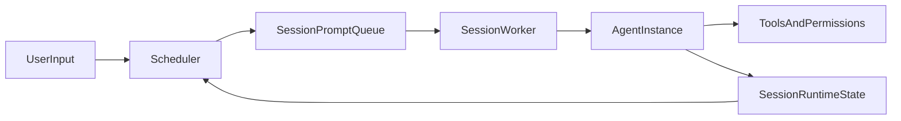
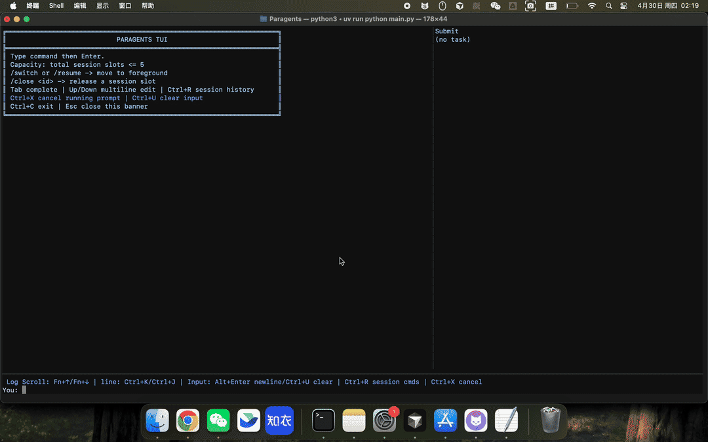

# Paragents

[中文文档](./README.zh-CN.md)

Paragents is a toy, easy-hack self-learning project for building a parallel-agent runtime in Python (`asyncio` + TUI). It is inspired by 4 other agent repos ([claude-code](https://github.com/anthropics/claude-code), [mercury-agent](https://github.com/cosmicstack-labs/mercury-agent), [hermes-agent](https://github.com/NousResearch/hermes-agent), [nanobot](https://github.com/HKUDS/nanobot)), and borrows ideas (and in some places implementation patterns) for learning and experimentation.  
It is intentionally optimized for readability and experimentation, not production hardening.

## Project Positioning

- This repo is an **experimental playground**, not a production framework.
- APIs and internal contracts may change quickly.
- The core value is to make agent runtime ideas easy to read, test, and iterate.

## Why Parallel-Agent

The current design focuses on **multi-session parallelism** with per-session continuity:

- Session-based scheduler and worker model
- Single active agent instance per session (reused across turns)
- Session-level context + memory persistence
- Preflight conflict checks (especially output conflicts) and approval flow
- TUI-first operations for observing multiple sessions



Key implementation files:

- `main.py`
- `scheduler.py`
- `agent_instance.py`
- `session_runtime.py`
- `tui_app.py`

## Demo



## Quick Start (TUI Only)

1. Install dependencies

```bash
uv sync
```

2. Start TUI

```bash
uv run python main.py
```

3. First run setup

- If `runtime_config.json` is missing, startup enters interactive setup.
- You can reconfigure in TUI with:
  - `/setup`
  - `/show-config`

4. Command reference

| Command | Purpose |
|---|---|
| `/new <text>` | Create a new foreground session with the initial prompt |
| `/prompt <text>` | Continue current foreground session with a new prompt |
| `/submit <text>` | Submit a new background session |
| `/list` | List current sessions and their status |
| `/switch <session_ref>` | Switch foreground focus to a target session |
| `/close <session_ref>` | Close a session and release its slot |
| `/approvals` | Show pending approval requests |
| `/approve <request_ref> [always]` | Approve a pending request (optional persistent allow) |
| `/deny <request_ref>` | Deny a pending request |
| `/pause <prompt_ref>` | Pause a running prompt |
| `/resume <session_ref>` | Resume paused prompt in target session |
| `/cancel <prompt_ref>` | Cancel target prompt |
| `/permissions` | Print current effective permission config |
| `/setup` | Re-run runtime/provider setup |
| `/show-config` | Show runtime config file path and provider info |
| `/quit` | Exit TUI |


## Cross-Repo Learning Notes (inlined)

Legend:

- **Code verified**: implementation or interface is directly confirmed in code.
- **Docs/changelog signal**: mainly inferred from README/changelog/config examples; full core implementation may not be fully open.

### 1) Permission and Capability Governance

| Dimension | Paragents | claude-code | mercury-agent | hermes-agent | nanobot |
|---|---|---|---|---|---|
| Capability switches | `PermissionsConfig.capabilities` (**Code verified**) | Tool-level permission governance in settings (**Docs/changelog signal**) | `permissions.yaml` + capability registry (**Code verified**) | Governance via toolset/gateway composition (**Code verified**) | `ToolsConfig` level toggles (**Code verified**) |
| ask/deny semantics | `needs_approval / blocked / auto_approved` (**Code verified**) | Explicit `ask/deny` (**Code verified**) | Command pattern-based approvals (**Code verified**) | Approval is more runtime-pipeline oriented (**Code verified**) | Primarily `enable/sandbox/restrict` style (**Code verified**) |
| File scope control | `fs_scopes` (**Code verified**) | Combined through tool permissions + policy layering (**Docs/changelog signal**) | File scopes (**Code verified**) | Mostly enforced in tool runtime (**Code verified**) | `restrict_to_workspace` (**Code verified**) |
| Sandbox/network policy | Relatively lightweight currently (**Code verified**) | `sandbox.network.*` (**Code verified**) | Basic shell constraints (e.g., cwd) (**Code verified**) | More gateway/runtime governance oriented (**Code verified**) | `exec.sandbox` + SSRF allowlist (**Code verified**) |

### 2) Context, Compaction, and Recovery

| Dimension | Paragents | claude-code | mercury-agent | hermes-agent | nanobot |
|---|---|---|---|---|---|
| Session continuity | Session worker + one reused agent per session (**Code verified**) | Strong `--resume/--continue` semantics (**Docs/changelog signal**) | conversationId-scoped short-term memory (**Code verified**) | Session + `contextvars` isolation (**Code verified**) | `SessionManager` persistence (**Code verified**) |
| Prompt construction | `PromptAssembler` abstraction (**Code verified**) | Core internals not fully public (**Docs/changelog signal**) | `system + relevantFacts + recentMemory + user` (**Code verified**) | Unified through ContextEngine (**Code verified**) | Layered assembly via ContextBuilder (**Code verified**) |
| Compaction strategy | `should_compact()/compact()` (**Code verified**) | auto-compact + pre-compact hook (**Docs/changelog signal**) | Mainly recent-N control (**Code verified**) | ContextEngine + Compressor (**Code verified**) | online consolidate + idle auto-compact (**Code verified**) |
| Interruption/recovery | `CheckpointRecovery + SessionStateStore` (**Code verified**) | Ongoing long-session recovery hardening (**Docs/changelog signal**) | Persistent memory resume (**Code verified**) | checkpoint manager (**Code verified**) | runtime checkpoint + keep-context on stop (**Code verified**) |

### 3) Current Paragents Conclusions

- The "policy config + ask/deny semantics" model is **partially in place** with `permissions.json` + `blocked/needs_approval/auto_approved`.
- Compared with `claude-code`, current gaps are mainly:
  - ask/deny logic is still fragmented across capability/policy domains instead of one unified rule layer;
  - missing a stronger hierarchical policy model (managed/user/project) and tool-level unified rule interpretation.

## Requirements

From `pyproject.toml`:

- Python `>=3.11`
- Runtime dependencies:
  - `httpx`
  - `prompt-toolkit`
- Dev dependency group:
  - `pytest`

System/runtime prerequisites:

- [`uv`](https://docs.astral.sh/uv/) installed
- An OpenAI-compatible endpoint configured in `runtime_config.json` (interactive setup on first run)

## TODO Roadmap

The detailed roadmap is in a dedicated file for readability:

- [TODO.md](./TODO.md)

At a glance:

- `P0`: IM integration, multi-session usability, and recovery hardening
- `P1`: context quality, policy unification, conflict UX, session invariants
- `P2`: observability, regression suites, and UI state-machine consistency

## Non-Goals / Caveats

- Not production-ready
- No stability guarantees on internal APIs
- Behavior may prioritize experimentation over strict backward compatibility

## Testing

Run core TUI regressions:

```bash
uv run pytest -q tests/test_tui_layout.py tests/test_tui_commands.py tests/test_run_approval_flow.py
```

## License

MIT.

Note: this README declares MIT intent. If a top-level `LICENSE` file is missing, add one before public distribution.

## Contributing

Small, focused PRs are preferred.

- Keep changes easy to review and easy to hack on.
- Add or update tests for behavioral changes.
- Prefer readability over cleverness.
