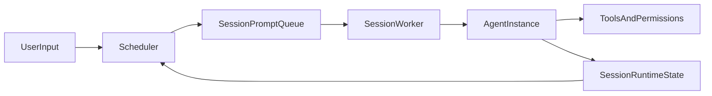

# Paragents（中文）

[English README](./README.md)

Paragents 是一个 toy、易 hack 的自学习项目，用于构建并行 agent runtime（Python `asyncio` + TUI）。项目受 4 个仓库启发并借鉴部分思路与实现模式：[claude-code](https://github.com/anthropics/claude-code)、[mercury-agent](https://github.com/cosmicstack-labs/mercury-agent)、[hermes-agent](https://github.com/NousResearch/hermes-agent)、[nanobot](https://github.com/HKUDS/nanobot)。  
它优先追求可读性与可实验性，不以生产级稳定为目标。

## 项目定位

- 本仓库是**实验性 playground**，不是生产框架。
- API 和内部契约可能快速变化。
- 核心价值是让 agent runtime 思路可读、可测、可快速迭代。

## 为什么是 Parallel-Agent

当前设计重点是“多会话并发 + 会话内连续性”：

- 基于 Session 的调度器与 worker 模型
- 每个 session 只保留一个活跃 agent 实例并跨轮复用
- 会话级上下文与记忆持久化
- 预判冲突（尤其输出冲突）与审批流
- TUI-first 的多会话观测与操作



关键实现文件：

- `main.py`
- `scheduler.py`
- `agent_instance.py`
- `session_runtime.py`
- `tui_app.py`

## Demo

```markdown

```

## 快速开始（仅 TUI）

1. 安装依赖

```bash
uv sync
```

2. 启动 TUI

```bash
uv run python main.py
```

3. 首次启动配置

- 若缺少 `runtime_config.json`，启动时会进入交互式配置。
- 可在 TUI 内通过以下命令重配：
  - `/setup`
  - `/show-config`

4. 命令参考

| 命令 | 作用 |
|---|---|
| `/new <text>` | 创建一个新的前台 session，并写入第一条 prompt |
| `/prompt <text>` | 在当前前台 session 继续追加新 prompt |
| `/submit <text>` | 提交一个新的后台 session |
| `/list` | 列出当前 session 与状态 |
| `/switch <session_ref>` | 将前台焦点切换到目标 session |
| `/close <session_ref>` | 关闭指定 session 并释放槽位 |
| `/approvals` | 查看待审批请求 |
| `/approve <request_ref> [always]` | 通过审批（可选持久放行） |
| `/deny <request_ref>` | 拒绝审批 |
| `/pause <prompt_ref>` | 暂停运行中的 prompt |
| `/resume <session_ref>` | 恢复指定 session 内暂停的 prompt |
| `/cancel <prompt_ref>` | 取消目标 prompt |
| `/permissions` | 查看当前生效权限配置 |
| `/setup` | 重新执行 runtime/provider 配置 |
| `/show-config` | 显示配置文件路径与 provider 信息 |
| `/quit` | 退出 TUI |

## 跨仓学习笔记（内嵌）

说明：

- **代码验证**：在对应仓库中能直接看到实现或接口。
- **文档/变更信号**：主要来自 README/CHANGELOG/配置示例，核心实现可能未完全开源。

### 1）权限与能力治理

| 维度 | Paragents | claude-code | mercury-agent | hermes-agent | nanobot |
|---|---|---|---|---|---|
| 能力开关 | `PermissionsConfig.capabilities`（代码验证） | settings 中工具级权限治理（文档/变更信号） | `permissions.yaml` + capability registry（代码验证） | toolset/gateway 组合治理（代码验证） | `ToolsConfig` 级开关（代码验证） |
| ask/deny 语义 | `needs_approval / blocked / auto_approved`（代码验证） | 显式 `ask/deny`（代码验证） | 命令模式匹配审批（代码验证） | 审批更偏运行链路（代码验证） | 以 `enable/sandbox/restrict` 为主（代码验证） |
| 文件范围控制 | `fs_scopes`（代码验证） | 工具权限 + 策略层组合（文档/变更信号） | file scopes（代码验证） | 多在 tool runtime 约束（代码验证） | `restrict_to_workspace`（代码验证） |
| 沙箱/网络策略 | 当前较轻量（代码验证） | `sandbox.network.*`（代码验证） | shell 基础约束（如 cwd）（代码验证） | 更偏网关/运行治理（代码验证） | `exec.sandbox` + SSRF allowlist（代码验证） |

### 2）上下文、压缩与恢复

| 维度 | Paragents | claude-code | mercury-agent | hermes-agent | nanobot |
|---|---|---|---|---|---|
| Session 连续性 | session worker + 单 session 复用 agent（代码验证） | `--resume/--continue` 语义强（文档/变更信号） | conversationId 级短期记忆（代码验证） | session + `contextvars` 隔离（代码验证） | `SessionManager` 持久化（代码验证） |
| Prompt 组装 | `PromptAssembler` 抽象（代码验证） | 核心内部未完全公开（文档/变更信号） | `system + relevantFacts + recentMemory + user`（代码验证） | ContextEngine 统一治理（代码验证） | ContextBuilder 分层组装（代码验证） |
| 压缩策略 | `should_compact()/compact()`（代码验证） | auto-compact + pre-compact hook（文档/变更信号） | 主要 recent-N 控制（代码验证） | ContextEngine + Compressor（代码验证） | 在线 consolidate + 空闲 auto-compact（代码验证） |
| 中断/恢复 | `CheckpointRecovery + SessionStateStore`（代码验证） | 长会话恢复持续修复（文档/变更信号） | 记忆持久化续跑（代码验证） | checkpoint manager（代码验证） | runtime checkpoint + stop 保留上下文（代码验证） |

### 3）当前结论

- “策略配置 + ask/deny 语义”已经**部分具备**：`permissions.json` + `blocked/needs_approval/auto_approved`。
- 相比 `claude-code`，主要差异是：
  - ask/deny 逻辑仍分散在多个域，尚未统一到单一规则层；
  - 缺少更完整的分层策略模型（managed/user/project）和工具级统一解释。

## 环境要求

来自 `pyproject.toml`：

- Python `>=3.11`
- 运行时依赖：
  - `httpx`
  - `prompt-toolkit`
- 开发依赖组：
  - `pytest`

系统前置条件：

- 已安装 [`uv`](https://docs.astral.sh/uv/)
- 已配置 OpenAI-compatible endpoint（首次启动可交互生成 `runtime_config.json`）

## TODO 路线图（内嵌）

本节基于 `docs/optimization-plan.md`，翻译并内嵌到 README。

### P0：IM 接入与多 Session 可用性（最高优先）

#### 0）通过 Telegram 等 IM 远程调用本地 Agent
- **目标**：像参考仓一样，让 IM 可以触发本机 Paragents 能力。
- **关键问题**：
  - 一个 Telegram bot 下如何并行管理多个 session；
  - 多 session 同时输出时，如何保证消息可读、可操作。
- **最小可用方案**：
  - 增加 IM gateway 层（先 Telegram），作为 `Scheduler` 的上游输入与输出分发器；
  - 使用 `chat_id + session_ref` 作为路由主键；
  - 用显式命令协议进行 switch/create（避免隐式歧义）；
  - 所有输出统一带 `session_ref` 前缀。
- **验收**：
  - 单 bot 可并发驱动 3-5 个 session；
  - 私聊/群聊路由稳定；
  - 用户可明确识别每条回复所属 session。

### P0：稳定性与可恢复性（先做）

#### 1）Session 状态原子写
- 问题：`JsonlSessionStateStore` 目前整文件重写，异常中断可能损坏。
- 改造：`*.tmp` 写入 -> `fsync` -> 原子替换；失败保留旧文件并记录错误。
- 验收：中断后重启仍可加载旧状态；不出现空文件/半截 JSONL 启动失败。

#### 2）Session 状态并发写保护
- 问题：多 worker 并发写入可能互相覆盖。
- 改造：为 `SessionStateStore` 加锁并串行 flush。
- 验收：3+ session 并发压测后无丢失、无错乱。

#### 3）状态 schema/version 与容错迁移
- 问题：字段演进会导致旧状态不可读。
- 改造：记录 `schema_version`，并做缺省补齐与向后兼容解析。
- 验收：低版本状态可被新代码读取并自动补齐。

#### 4）checkpoint 生命周期清晰化
- 问题：turn/session checkpoint 边界不清晰。
- 改造：区分 `turn_checkpoint` 与 `session_checkpoint`；debug 输出恢复来源。
- 验收：日志可清晰定位恢复层级来源。

---

### P1：上下文压缩与 Prompt 质量（核心体验）

#### 5）压缩触发策略化
- 改造 `should_compact()` 为多维阈值（轮数、字符量、估算 token、tool 输出膨胀），并配置化。

#### 6）压缩内容结构化
- 摘要模板统一为：`已完成 / 未完成 / 关键约束 / 下一步`，控制长度避免反向污染。

#### 7）Prompt 分层开关化（Hermes/Nanobot 最小策略）
- 已有：runtime metadata + memory summary + compact notes + recent turns + latest user input。
- 下一步：增加开关 `runtime_block_enabled`、`memory_summary_enabled`、`compact_notes_enabled`，支持 session 级 profile 覆盖。

#### 8）历史污染控制
- 大 tool 输出只保留摘要/指针，保留关键 observation，裁剪低价值日志。

---

### P1：权限与冲突预判体系

#### 9）统一策略层（ask/deny 收敛）
- 现状：已有 `permissions.json` + 三态规则，但逻辑仍分散。
- 改造：统一到 tool/capability/path 三层规则，优先级固定 `deny > ask > allow`。

#### 10）输出冲突判定增强
- 在 `out:*` 主原则上，补充目录级与临时产物冲突模式。

#### 11）冲突决策 UX 增强
- `/override` `/cancel` 明确展示“将覆盖路径 + 前置占用 session_ref”；
- 决策后立即清理冲突高亮。

---

### P1：会话语义与调度模型

#### 12）单 session 单 agent 不变式监控
- 增加 session->agent 唯一性断言与指标。

#### 13）`turn_done` 语义彻底收敛
- 逐步移除 `final` 兼容路径，测试与文档统一 `turn_done`。

#### 14）session worker 健康探针
- 增加心跳、队列长度、阻塞时长指标，定位“thinking 卡住”。

---

### P2：可观测性、测试与 TUI 打磨

#### 15）结构化调试事件
- `compact_notes/memory_summary/recent_turns` 改为结构化 debug 事件。

#### 16）关键链路 trace_id
- preflight -> approval -> run -> turn_done 全链路挂同一 trace_id。

#### 17）回归场景库
- 固化冲突、审批、暂停恢复、连续多轮上下文等高频历史问题。

#### 18）命令补全与冲突态统一状态机
- 抽象 `/switch` `/override` `/cancel` 候选规则；
- 冲突高亮生命周期由统一状态机驱动。

#### 19）Skill 能力支持（发现、加载、执行）
- **目标**：将 Skill 能力升级为一等公民，让 session 可以安全、可观测地复用技能包。
- **轻量拆解**：
  - 定义 `SkillSpec` 结构（`name`、`version`、`inputs`、`outputs`、`permissions`、`entrypoint`）；
  - 实现 skill registry + loader（先本地目录，再预留远程索引）；
  - 打通执行沙箱与权限桥接（skill 执行必须走现有策略校验）；
  - 增加 TUI/IM 指令：`/skills`、`/skill use <name>`、`/skill info <name>`；
  - 增加可观测字段：`skill_name`、`skill_version`、`skill_run_id`、耗时与失败原因。
- **验收**：
  - 用户可在单个 session 内列出并执行 skill；
  - skill 失败可定位且不破坏 session worker 生命周期；
  - skill 调用遵守 `deny > ask > allow` 策略优先级。

---

### 建议两周执行顺序

第 1 周（稳定性）：
1. P0 IM 最小闭环（TODO-00 ~ TODO-00C）
2. P0 稳定性（TODO-01 ~ TODO-04）
3. P1-5（基础触发策略）

第 2 周（体验与治理）：
1. P1-6~8（compact + prompt）
2. P1-9~11（权限 + 冲突）
3. P2-15~17（可观测 + 回归）

### 当前状态备注

- 已完成：
  - `CompactionEngine` 拆分为 `should_compact()/compact()`
  - `SessionStateStore` JSONL 持久化
  - Prompt 分层最小策略接入
- 待推进：
  - 原子写与并发锁
  - 统一 ask/deny 策略层
  - 可观测与回归体系

### 可执行 TODO（文件粒度）

为避免中英 README 维护漂移，本节使用与英文版一致的 ID 与职责边界（TODO-00 ~ TODO-18），详细内容与英文版一一对应：

- `TODO-00`~`TODO-00C`：IM 网关、路由、可读性协议、命令体验
- `TODO-01`~`TODO-04`：状态持久化原子写、并发锁、schema 迁移、checkpoint 分层
- `TODO-05`~`TODO-08`：compaction 触发与结构化、prompt 分层开关、历史污染控制
- `TODO-09`~`TODO-11`：统一策略层、输出冲突增强、冲突决策 UX
- `TODO-12`~`TODO-14`：单 session 单 agent 监控、`turn_done` 收敛、worker 健康探针
- `TODO-15`~`TODO-17`：结构化 debug + trace_id、回归场景库、命令与冲突状态机统一
- `TODO-18`：Skill 框架最小集成（spec/registry/loader/执行链路/命令入口）

如需逐条落地，可直接按英文 README 的每个 TODO 块执行并提交。

## 非目标 / 注意事项

- 非生产可用
- 不保证内部 API 稳定性
- 行为可能优先实验迭代而非向后兼容

## 测试

运行核心 TUI 回归：

```bash
uv run pytest -q tests/test_tui_layout.py tests/test_tui_commands.py tests/test_run_approval_flow.py
```

## License

MIT。

说明：README 声明为 MIT，若仓库根目录暂无 `LICENSE` 文件，请在公开分发前补齐。

## Contributing

建议小步、聚焦、可评审的 PR：

- 改动尽量易读、易 hack
- 行为变化需补充/更新测试
- 优先可维护性，避免炫技实现
