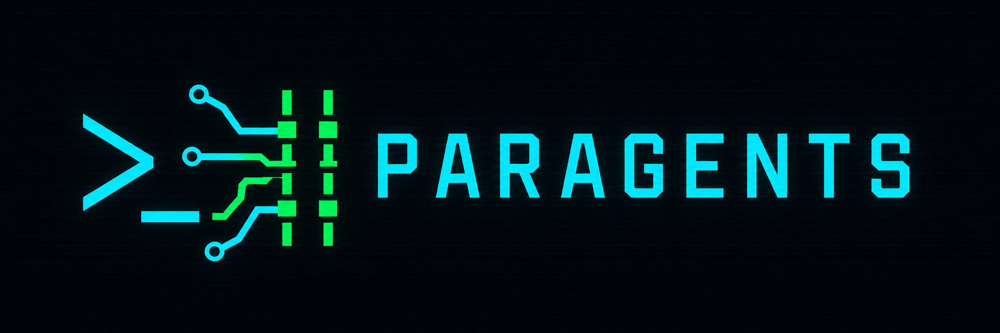
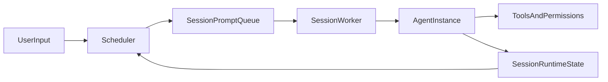

<p align="center">
  
</p>

<p align="center"><strong>
在同一个面板里并行运行多路 agent 会话：工具带权限感知，并支持预判式冲突检测。
</strong></p>

<p align="center">
跨轮延续上下文。高风险操作前会先询问。多会话并行，配合冲突预判与安全执行路径。<br />
以 TUI 为主的工作流；工具可扩展；策略规则显式可见。
</p>

<p align="center">
灵感来自以下 4 个 agent 相关仓库：
  <a href="https://github.com/anthropics/claude-code">claude-code</a>、
  <a href="https://github.com/cosmicstack-labs/mercury-agent">mercury-agent</a>、
  <a href="https://github.com/NousResearch/hermes-agent">hermes-agent</a>、
  <a href="https://github.com/HKUDS/nanobot">nanobot</a>。
</p>

<p align="center">
  
  
</p>

<p align="center">
  <a href="./README.md">English</a> | 简体中文
</p>

## Demo


## 快速开始（仅 TUI）

1. 安装依赖

```bash
uv sync
```

2. 启动 TUI

```bash
uv run python main.py
```

3. 首次启动配置

- 若缺少 `runtime_config.json`，启动时会进入交互式配置。
- 可在 TUI 内通过以下命令重配：
  - `/setup`
  - `/show-config`

4. 命令参考

| 命令 | 作用 |
|---|---|
| `/new <text>` | 创建一个新的前台 session，并写入第一条 prompt |
| `/prompt <text>` | 在当前前台 session 继续追加新 prompt |
| `/submit <text>` | 提交一个新的后台 session |
| `/list` | 列出当前 session 与状态 |
| `/switch <session_ref>` | 将前台焦点切换到目标 session |
| `/close <session_ref>` | 关闭指定 session 并释放槽位 |
| `/approvals` | 查看待审批请求 |
| `/approve <request_ref> [always]` | 通过审批（可选持久放行） |
| `/deny <request_ref>` | 拒绝审批 |
| `/pause <prompt_ref>` | 暂停运行中的 prompt |
| `/resume <session_ref>` | 恢复指定 session 内暂停的 prompt |
| `/cancel <prompt_ref>` | 取消目标 prompt |
| `/permissions` | 查看当前生效权限配置 |
| `/setup` | 重新执行 runtime/provider 配置 |
| `/show-config` | 显示配置文件路径与 provider 信息 |
| `/quit` | 退出 TUI |

## 为什么是 Parallel-Agent

当前设计重点是「**多会话并行**」，且每个会话内保持连续性：

- 基于 Session 的调度器与 worker 模型
- 每个 session 只保留一个活跃 agent 实例并跨轮复用
- 会话级上下文与记忆持久化
- 预判冲突（尤其输出冲突）与审批流
- TUI-first：一块面板观测、操作多个会话



关键实现文件：

- `main.py`
- `scheduler.py`
- `agent_instance.py`
- `session_runtime.py`
- `tui_app.py`

Paragents 是 toy、易 hack 的自学习项目，不以生产级稳定为第一目标。

## 跨仓学习笔记（内嵌）

说明：

- **代码验证**：在对应仓库中能直接看到实现或接口。
- **文档/变更信号**：主要来自 README/CHANGELOG/配置示例，核心实现可能未完全开源。

### 1）权限与能力治理

| 维度 | Paragents | claude-code | mercury-agent | hermes-agent | nanobot |
|---|---|---|---|---|---|
| 能力开关 | `PermissionsConfig.capabilities`（代码验证） | settings 中工具级权限治理（文档/变更信号） | `permissions.yaml` + capability registry（代码验证） | toolset/gateway 组合治理（代码验证） | `ToolsConfig` 级开关（代码验证） |
| ask/deny 语义 | `needs_approval / blocked / auto_approved`（代码验证） | 显式 `ask/deny`（代码验证） | 命令模式匹配审批（代码验证） | 审批更偏运行链路（代码验证） | 以 `enable/sandbox/restrict` 为主（代码验证） |
| 文件范围控制 | `fs_scopes`（代码验证） | 工具权限 + 策略层组合（文档/变更信号） | file scopes（代码验证） | 多在 tool runtime 约束（代码验证） | `restrict_to_workspace`（代码验证） |
| 沙箱/网络策略 | 当前较轻量（代码验证） | `sandbox.network.*`（代码验证） | shell 基础约束（如 cwd）（代码验证） | 更偏网关/运行治理（代码验证） | `exec.sandbox` + SSRF allowlist（代码验证） |

### 2）上下文、压缩与恢复

| 维度 | Paragents | claude-code | mercury-agent | hermes-agent | nanobot |
|---|---|---|---|---|---|
| Session 连续性 | session worker + 单 session 复用 agent（代码验证） | `--resume/--continue` 语义强（文档/变更信号） | conversationId 级短期记忆（代码验证） | session + `contextvars` 隔离（代码验证） | `SessionManager` 持久化（代码验证） |
| Prompt 组装 | `PromptAssembler` 抽象（代码验证） | 核心内部未完全公开（文档/变更信号） | `system + relevantFacts + recentMemory + user`（代码验证） | ContextEngine 统一治理（代码验证） | ContextBuilder 分层组装（代码验证） |
| 压缩策略 | `should_compact()/compact()`（代码验证） | auto-compact + pre-compact hook（文档/变更信号） | 主要 recent-N 控制（代码验证） | ContextEngine + Compressor（代码验证） | 在线 consolidate + 空闲 auto-compact（代码验证） |
| 中断/恢复 | `CheckpointRecovery + SessionStateStore`（代码验证） | 长会话恢复持续修复（文档/变更信号） | 记忆持久化续跑（代码验证） | checkpoint manager（代码验证） | runtime checkpoint + stop 保留上下文（代码验证） |

### 3）当前结论

- 「策略配置 + ask/deny 语义」已经**部分具备**：`permissions.json` + `blocked/needs_approval/auto_approved`。
- 相比 `claude-code`，主要差异是：
  - ask/deny 逻辑仍分散在多个域，尚未统一到单一规则层；
  - 缺少更完整的分层策略模型（managed/user/project）和工具级统一解释。

## 环境要求

来自 `pyproject.toml`：

- Python `>=3.11`
- 运行时依赖：
  - `httpx`
  - `prompt-toolkit`
- 开发依赖组：
  - `pytest`

系统前置条件：

- 已安装 [`uv`](https://docs.astral.sh/uv/)
- 已配置 OpenAI-compatible endpoint（首次启动可交互生成 `runtime_config.json`）

## TODO 路线图

完整路线图见：

- [TODO.md](./TODO.md)

概览：

- **P0**：IM 接入、多会话可用性、持久化与可恢复性
- **P1**：上下文质量、策略统一、冲突体验、会话不变式
- **P2**：可观测性、回归套件与 TUI 状态机一致性

## 非目标 / 注意事项

- 非生产可用
- 不保证内部 API 稳定性
- 行为可能优先实验迭代而非向后兼容

## 测试

运行核心 TUI 回归：

```bash
uv run pytest -q tests/test_tui_layout.py tests/test_tui_commands.py tests/test_run_approval_flow.py
```

## License

MIT。

说明：README 声明为 MIT；若仓库根目录暂无 `LICENSE` 文件，请在公开分发前补齐。

## Contributing

建议小步、聚焦、可评审的 PR：

- 改动尽量易读、易 hack
- 行为变化需补充/更新测试
- 优先可维护性，避免炫技实现
